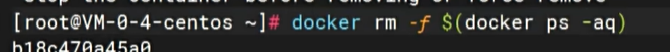
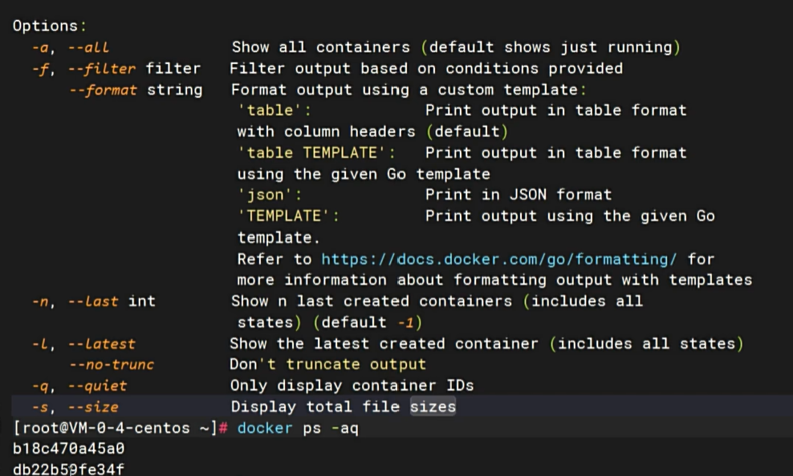
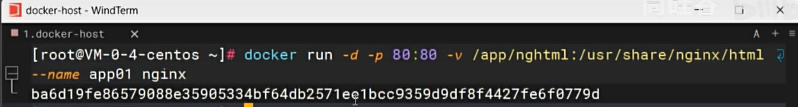
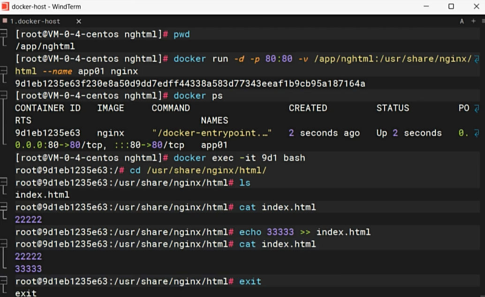
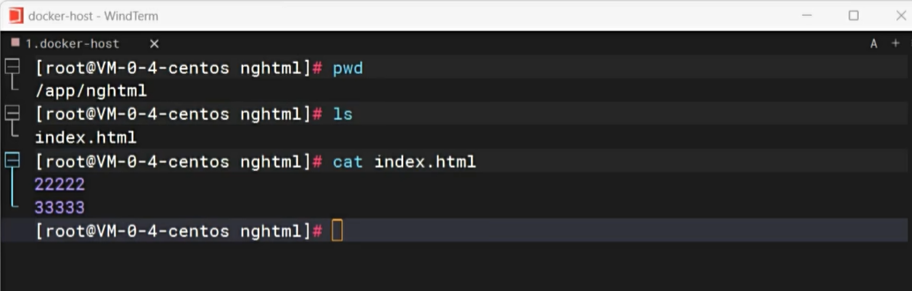
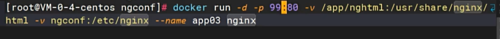
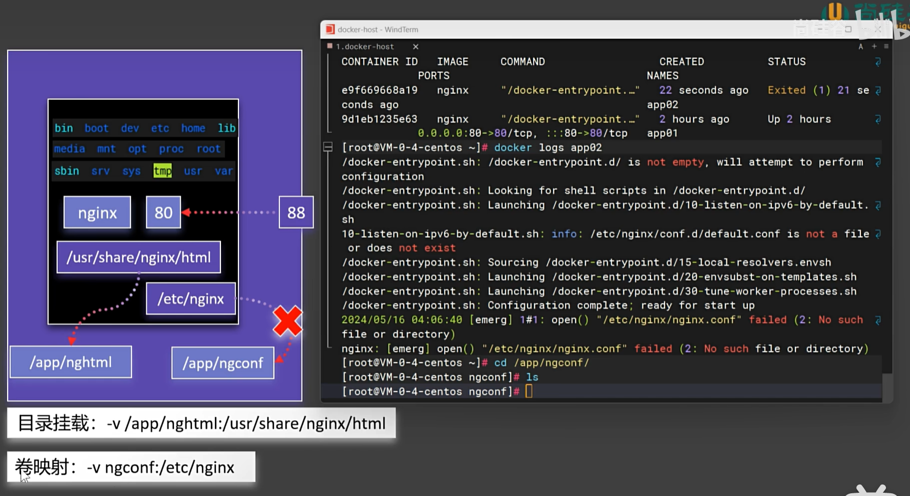
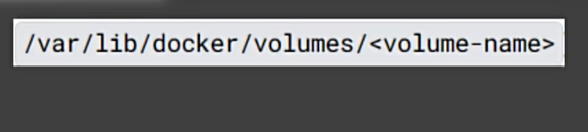
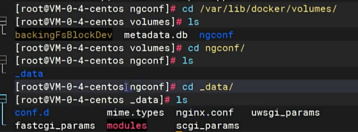
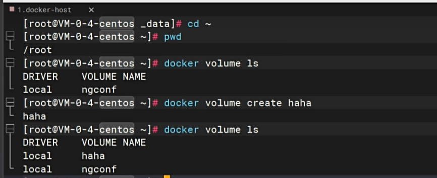

# Docker Storage

Learn to master directory mounting and data volumes to ensure container data is not lost. Containers themselves are like small virtual machines, making modifications inconvenient. Moreover, if a container is deleted, the stored data will also be lost.

## Force remove all currently running containers with the following command:

## Print all container IDs:

## Use directory mounting to solve data loss issues:

Add the `-v` statement to point the host machine address to the container's internal address. If the host directory does not exist, it will be automatically created. Even if the container is deleted, the external folder still exists. Restarting with the following command will show that the previously modified content remains unchanged.

Conversely, modifying within the container and then accessing from outside will show consistent content. The following command demonstrates modifying the container internally and then exiting:

Return to the host container and restart; the modifications will persist:

## Volume mapping ensures that the host files are successfully mapped:

Once mapping is successful, the host files will contain all the files from the container image, consistent with the container content at the initial startup. Here, the volume name `ngconf` is configured:

Docker uniformly places configuration files in this location, accessible from the host machine:

Entering this location reveals our volume `ngconf`. Inside `ngconf`, all configuration files are in a folder named `data`:

Volumes can also be manually created and viewed with the following command. Even if the container is deleted, the volume will be retained. Restarting with the same volume will preserve previous modifications:

