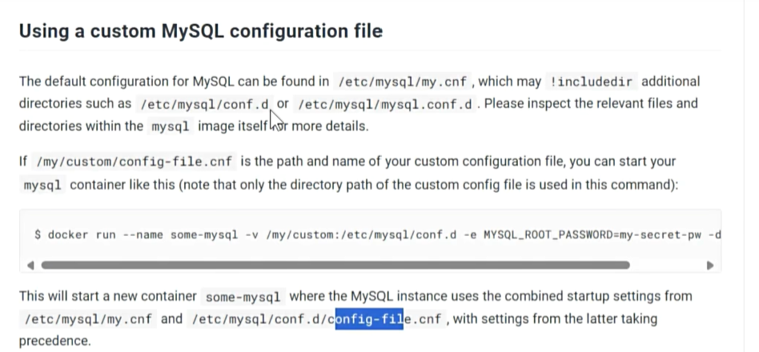

# Docker Network

Each Docker container has its own unique IP address, allowing containers to communicate with each other.

## Docker Network

The `docker network` command encompasses all network-related commands.

## Custom Network

Create a custom network.

## Start Two Containers with a Custom Network

Use the custom network to start two containers.

## Access Using Container Internal Network

Access using the internal network of the container.

The page data is displayed normally after pressing Enter.

## Best Practices Using MySQL as an Example

Best practices, using MySQL as an example.

You can find more information in the official documentation. For example, files ending with `.cnf` will be considered MySQL configuration files by default.

The documentation provides the location of MySQL data storage. There are details that may not be mentioned, such as the port. The default port for MySQL is 3306.

You can find image version tags in the tag section. If no tag is specified, the latest version will be used by default.

## Running a New Container Instance with `docker run`

The backslash `\` is used for line continuation. The `docker run` command is used to run a new container instance.

- The `-d` parameter runs the container in detached mode, meaning it will run in the background and not block the current terminal.
- The `-p 3306:3306` parameter maps port 3306 on the host to port 3306 in the container. This is MySQL's default port, allowing you to access MySQL services in the container through port 3306 on the host.
- The `-v /app/myconf:/etc/mysql/conf.d` parameter mounts a volume, mapping the host directory `/app/myconf` to the `/etc/mysql/conf.d` directory inside the container. This directory is typically used to store MySQL configuration files, so you can modify MySQL configuration files on the host and immediately apply them to the MySQL service inside the container.
- Another `-v /app/mydata:/var/lib/mysql` parameter maps the host directory `/app/mydata` to the `/var/lib/mysql` directory inside the container. This directory is where MySQL stores its data, allowing you to persist MySQL data on the host.
- The `-e MYSQL_ROOT_PASSWORD=123456` parameter sets an environment variable, configuring the MySQL root user password to `123456`.
- The `mysql:8.0.37-debian` specifies the Docker image and tag to use, indicating MySQL version 8.0.37 based on a Debian image. If the image is not available locally, Docker will automatically pull it from Docker Hub.

