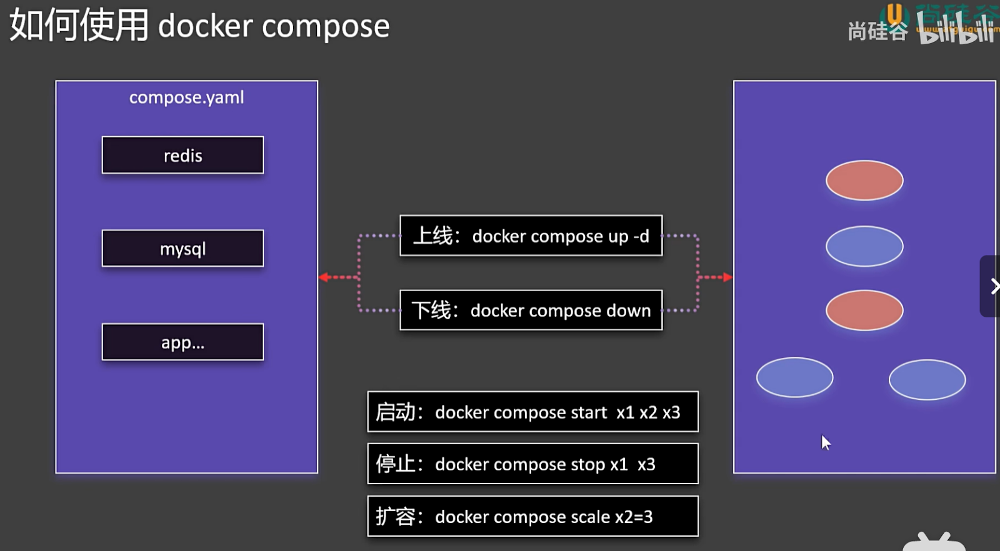
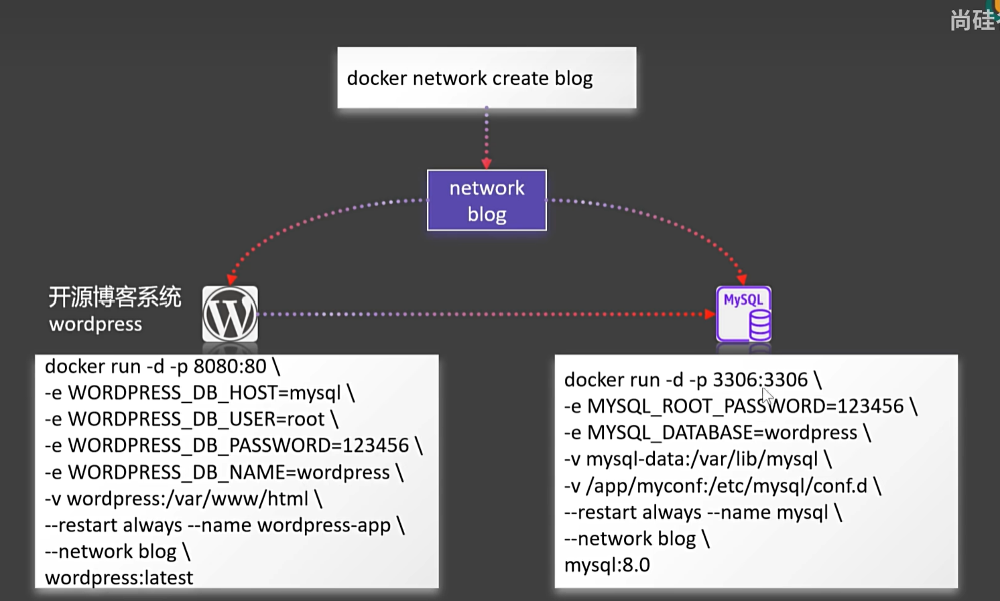
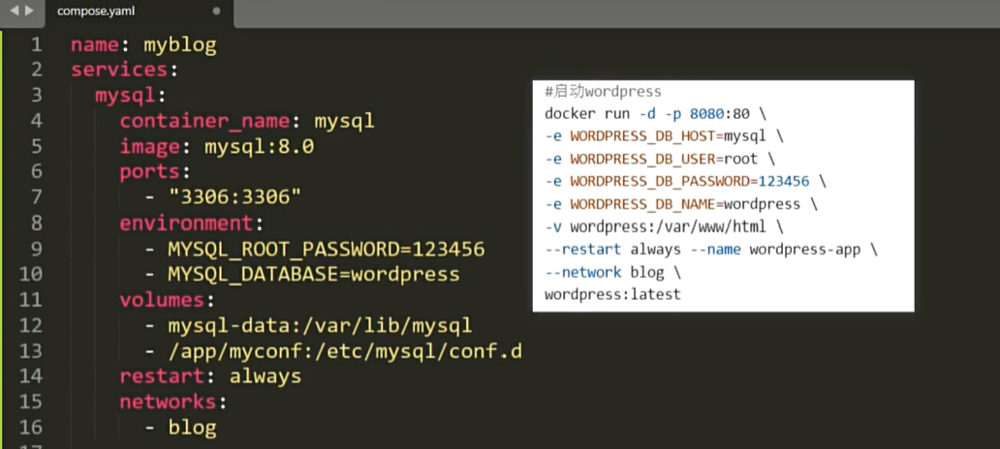
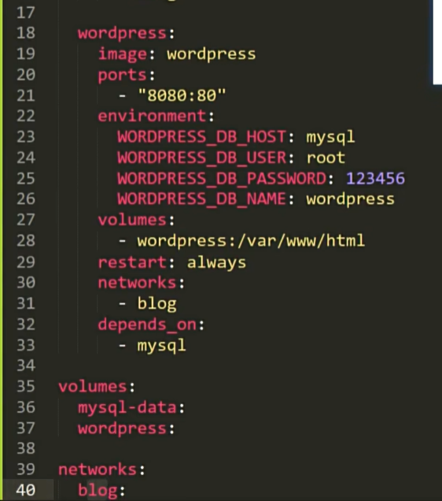
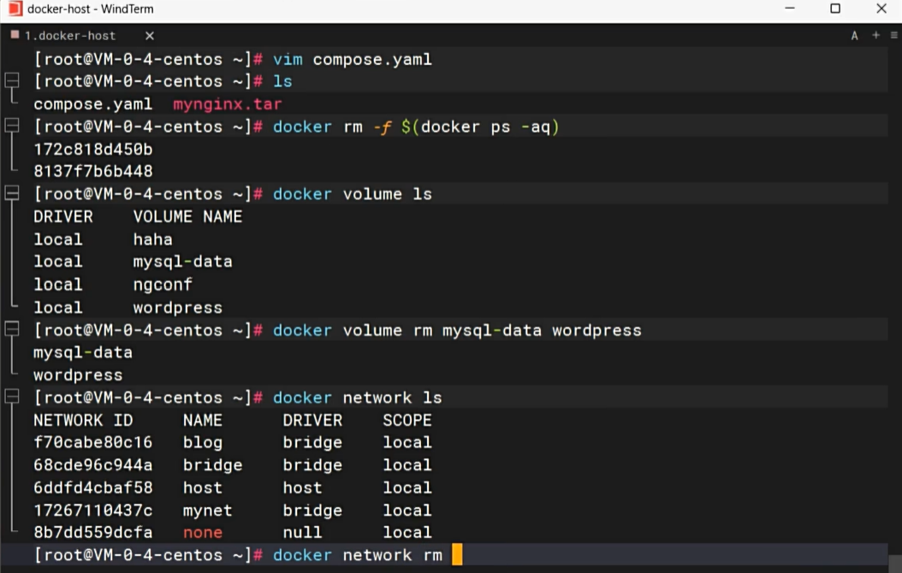

# Docker Compose for Batch Management of Containers



## Deployment Example: Previous Method

Previously, each container was started separately, and blog content would be stored in MySQL.



Refer to the official documentation for writing compose files. Docker Compose is a tool for defining and running multi-container Docker applications. By using a YAML file, you can configure all services, networks, and volumes in your application, simplifying container management and deployment.

The `docker-compose.yml` file is the configuration file for Docker Compose, used to define the services, networks, and volumes of an application. Below is a simple example of a `docker-compose.yml` file that defines an application with MySQL and WordPress services:

```yaml
version: '3.8'  # Specify the version of the Docker Compose file

services:  # Define services
  db:  # MySQL service
    image: mysql:5.7  # Use MySQL 5.7 image
    volumes:
      - db_data:/var/lib/mysql  # Mount volume
    environment:  # Set environment variables
      MYSQL_ROOT_PASSWORD: example
      MYSQL_DATABASE: wordpress
      MYSQL_USER: wordpress
      MYSQL_PASSWORD: wordpress

  wordpress:  # WordPress service
    image: wordpress:latest  # Use the latest WordPress image
    ports:
      - "8000:80"  # Map host port 8000 to container port 80
    environment:  # Set environment variables
      WORDPRESS_DB_HOST: db:3306
      WORDPRESS_DB_USER: wordpress
      WORDPRESS_DB_PASSWORD: wordpress
      WORDPRESS_DB_NAME: wordpress
    depends_on:
      - db  # WordPress service depends on MySQL service

volumes:  # Define volumes
  db_data:  # Data volume for persisting MySQL data
```

version: Specifies the version of the Docker Compose file.  
services: Defines the various services of the application. Each service has its own configuration.  
db: Defines the MySQL service.  
image: Specifies the Docker image to use (e.g., mysql:5.7).  
volumes: Defines the volume for persisting data to the host.  
environment: Sets environment variables such as database password and name.  
wordpress: Defines the WordPress service.  
image: Specifies the Docker image to use (e.g., wordpress).  
ports: Maps host ports to container ports.  
environment: Sets environment variables such as database connection information.  
depends_on: Specifies the dependency of services, ensuring that the db service starts before the wordpress service.  
volumes: Defines volumes for persisting data.  

## Using Docker Compose

### Create the `docker-compose.yml` File
Create a file named `docker-compose.yml` in your project directory and copy the content from the previous example into the file.

### Start Services
Run the following command in the project directory to start all defined services:
```sh
docker-compose up
Run Services in the Background
If you want to run services in the background, you can use the -d parameter:

docker-compose up -d
Stop Services
To stop services and remove containers, use the following command:

docker-compose down
View Logs
You can use the following command to view logs for all services:

docker-compose logs
With Docker Compose, you can easily define and manage complex multi-container applications, ensuring they run consistently in any environment.




Add Compose File and Remove All Current Images


Start Compose File
The name format is application_name_network_name.

