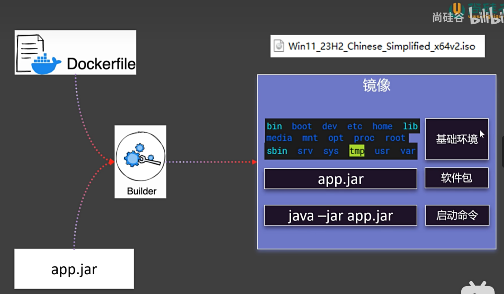

# Dockerfile



Dockerfile is a text file that contains a series of instructions that define how to build a Docker image. It allows for automated creation of custom Docker images.


## Basic Structure of Dockerfile

Here is a simple Dockerfile example and its explanation:

```dockerfile
# Select base image
FROM node:14

# Create and set working directory
WORKDIR /app

# Copy all files from the current directory to the working directory
COPY . .

# Install dependencies
RUN npm install

# Expose the port the app runs on
EXPOSE 3000

# Run the app
CMD ["node", "app.js"]
```

Dockerfile Instructions Explained:

FROM: Specifies the base image to build the image from. Example: FROM node:14 uses the official Node.js version 14 image as the base image.
WORKDIR: Sets the working directory. All subsequent commands (like RUN, CMD, COPY) are run in this directory. Example: WORKDIR /app sets /app as the working directory.
COPY: Copies files from the host to the image. Example: COPY . . copies all files from the current directory to the /app working directory in the image.
RUN: Executes commands in the image during the build process. Example: RUN npm install runs the npm install command in the image to install dependencies.
EXPOSE: Declares the port on which the container will listen at runtime. Example: EXPOSE 3000 indicates that the container listens on port 3000.
CMD: Specifies the command to run when the container starts. Only the last CMD instruction in a Dockerfile takes effect. Example: CMD ["node", "app.js"] runs node app.js when the container starts.

Creating and Using a Dockerfile
Create Dockerfile: Create a file named Dockerfile in your project directory and paste the content above into the file.

Build Docker Image: Use the docker build command to build the Docker image:
```sh
docker build -t my-node-app .
```
The -t flag specifies the name and tag for the image. my-node-app is the image name, and . indicates the current directory where the Dockerfile is located.

Run Docker Container: Use the docker run command to run the built image:
```sh
docker run -p 3000:3000 my-node-app
```
The -p flag maps the host's port 3000 to the container's port 3000.

More Dockerfile Instructions
Apart from the commonly used instructions above, Dockerfile supports several other instructions:

ENV: Sets environment variables. Example: ENV NODE_ENV production

ADD: Similar to COPY, but can automatically extract tar files and supports downloading files from URLs. Example: ADD https://example.com/file.tar.gz /app/

ENTRYPOINT: Configures a container that will run as an executable. Can be used with CMD. Example: ENTRYPOINT ["npm", "start"]

VOLUME: Creates a mount point for persistent data storage. Example: VOLUME /app/data

USER: Sets the user to run subsequent commands. Example: USER node

With Dockerfile, you can define and automate the process of creating Docker images, ensuring your application can be built and run consistently in any Docker-supported environment.

Upload a JAR Package Using rz Command (Our Software)


Create Dockerfile and Enter Insert Mode by clicking key 'i'


Write Dockerfile in Insert Mode and Save with :wq


Check Dockerfile


Build Image and Copy JAR Package to Container


