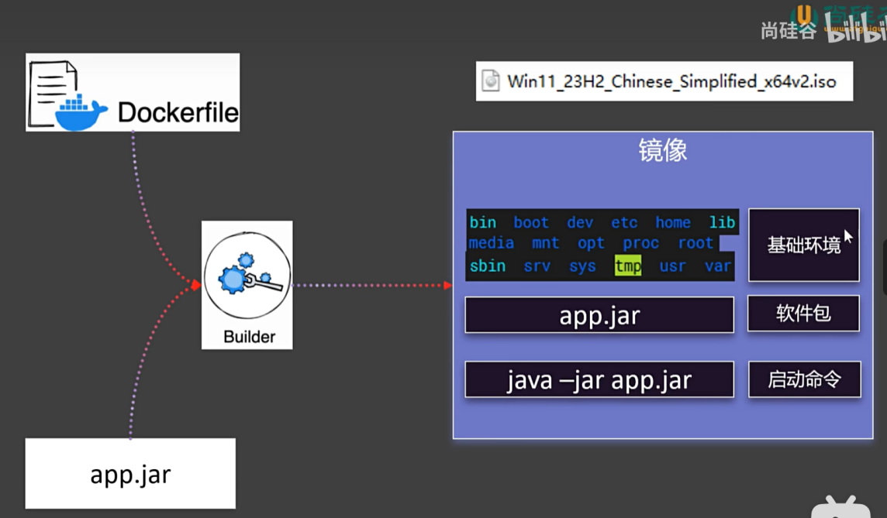

# Docker Learning Notes

This repository contains my learning notes on Docker, covering from the basics to more advanced topics. Each section is divided into smaller markdown files for easier navigation and reading.

## Table of Contents

1. [Docker Commands](./01%20Docker%20Commands.md)
2. [Docker Storage](./02%20Docker%20Storage.md)
3. [Docker Network](./03%20Docker%20Network.md)
4. [Docker Compose Batch Management](./04%20Docker%20Compose%20Batch%20Management.md)
5. [Dockerfile Basics](./05%20Dockerfile%20Basics.md)

## Overview

Docker is a powerful tool for containerizing applications, making it easier to develop, deploy, and manage software in a consistent environment. These notes cover Docker's core concepts, commands, and advanced usage.

## Learning Resources

- [Official Docker Documentation](https://docs.docker.com/)
- [Docker Tutorials](https://www.docker.com/101-tutorial)
- [Docker Cheat Sheet](https://dockerlabs.collabnix.com/docker/cheatsheet/)

Feel free to explore the notes and enhance your understanding of Docker.

## Contact

If you have any questions or would like to connect, please feel free to reach out to me on [LinkedIn](https://www.linkedin.com/in/your-linkedin-profile) or via [email](mailto:your-email@example.com).

---

### File Details:

1. **01 Docker Commands.md**: Covers basic Docker commands.
2. **02 Docker Storage.md**: Explains how to manage Docker storage, including volume and bind mounts.
3. **03 Docker Network.md**: Discusses Docker networking concepts and commands.
4. **04 Docker Compose Batch Management.md**: Describes using Docker Compose for managing multiple containers.
5. **05 Dockerfile Basics.md**: Provides an introduction to writing Dockerfiles for creating custom Docker images.

Images used in the documentation are stored in the `images` folder for better readability and reference.

